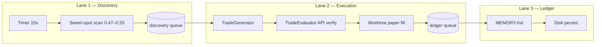

# Osmani Loop Engineering Architecture (Bot-1)

Implementation of Addy Osmani's 2026 Loop Engineering framework for the pulse paper bot.

## Overview

The monolithic `tick()` remains for arb, dep-arb, and grading — but **directional sweet-spot
discovery and verified execution** run through three decoupled async lanes:



## Lanes

| Lane | Module | Responsibility |
|------|--------|----------------|
| **Discovery** | `loop_architecture/lanes.py::DiscoveryLane` | Timer-driven triage on 1h directional series; emits opportunities when ask ∈ [0.47, 0.55] and edge ≥ `min_edge` |
| **Execution** | `ExecutionLane` | Isolated **worktree** per opportunity (snapshot copy); `TradeGenerator` → skeptical `TradeEvaluator` |
| **Ledger** | `LedgerLane` | Single-writer queue; updates `MEMORY.md` + calls engine `_persist()` |

## Maker-checker

| Role | Class | Behavior |
|------|-------|----------|
| **Maker** | `TradeGenerator` | Proposes paper trade from discovery opportunity |
| **Checker** | `TradeEvaluator` | **Assumes failure** until independent `hydrate_books()` API re-fetch passes `evaluate_execution()` with +EV |

This is separate from the Claude directional verifier (observe/shadow). The Osmani evaluator is
deterministic and book-based.

## MEMORY.md

Path: `{HTE_DATA_DIR}/MEMORY.md`

Read on process wake (`OsmaniLoopCoordinator.wake()`). Updated on each ledger persist with:

- Wake count and timestamp
- Lane status snapshots
- Capital snapshot
- Recent verified/rejected decisions
- Active constraints (paper-only, honest accounting)

Complements `LESSONS.md` (graded rules) and `STATE.md` (human snapshot).

## Circuit breaker

`LoopCircuitBreaker` enforces hard caps:

| Cap | Env | Default |
|-----|-----|---------|
| Daily token budget | `PULSE_LOOP_MAX_DAILY_TOKEN_USD` | $50 |
| Hourly API calls | `PULSE_LOOP_MAX_API_CALLS_PER_HOUR` | 500 |
| Min on-hand capital | `PULSE_LOOP_MIN_ON_HAND_USD` | $50 |
| Max drawdown | `PULSE_LOOP_MAX_DRAWDOWN_PCT` | 40% |
| Lane retry ceiling | `PULSE_LOOP_MAX_LANE_RETRIES` | 5 |
| Consecutive errors | `PULSE_LOOP_MAX_CONSECUTIVE_ERRORS` | 20 |

On trip: **clean `sys.exit(2)`** — no silent degradation.

## Legacy tick authority

When `PULSE_OSMANI_LOOP_ENABLED=1` and `PULSE_DIRECTIONAL_LEGACY_TICK=0` (default):

- **Tick loop** still runs TV intake, Grok decider requests, LLM council, Claude verifier
  requests, arb/dep-arb scans, settlement, and grading — but **does not place directional fills**.
- Candidates finalize as `skipped:osmani_lane_authority` after observe-only signal wiring.
- **Directional fills** are owned exclusively by the Osmani Execution lane (maker-checker +
  Claude verifier gate on fill + bankroll caps).

Set `PULSE_DIRECTIONAL_LEGACY_TICK=1` only to run both paths (not recommended — double-fill risk).

## Configuration

| Env | Default | Purpose |
|-----|---------|---------|
| `PULSE_OSMANI_LOOP_ENABLED` | `1` | Master switch |
| `PULSE_OSMANI_DISCOVERY_INTERVAL_S` | `15` | Discovery timer cadence |
| `PULSE_DIRECTIONAL_LEGACY_TICK` | `0` | When `0`, tick() does not place directional fills |
| `PULSE_LOOP_CIRCUIT_BREAKER_ENABLED` | `1` | Hard caps |

## Code map

```
engine/pulse/loop_architecture/
  coordinator.py   # OsmaniLoopCoordinator
  lanes.py         # Discovery / Execution / Ledger
  maker_checker.py # Generator + Evaluator
  memory.py        # MEMORY.md
  circuit_breaker.py
```

Wired in `engine/pulse/engine.py` (`PulseEngine.osmani_loop`).

## PAPER ONLY

All lanes are paper simulation. `live_trading_enabled` must remain false.
